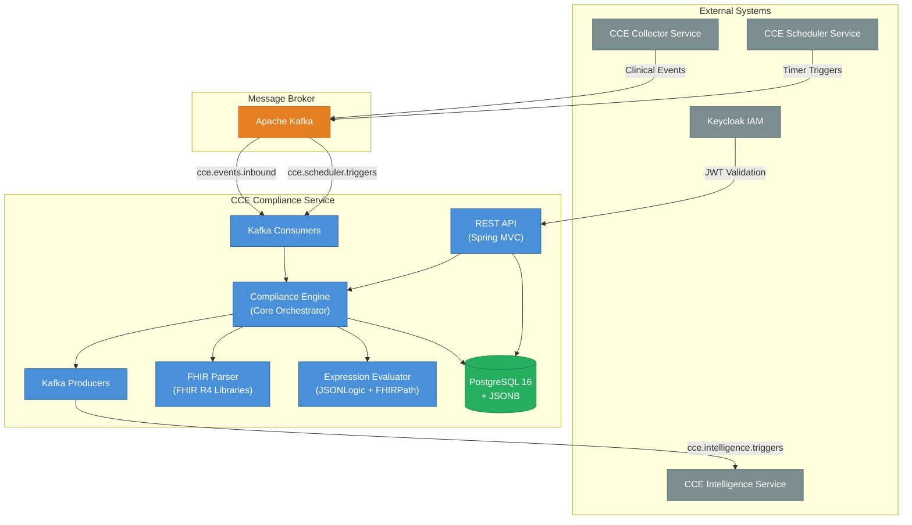
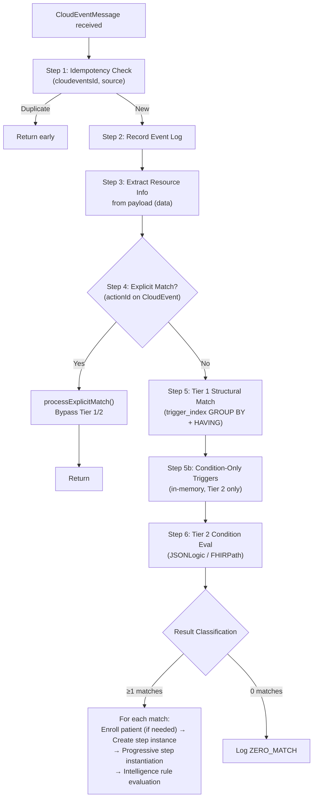
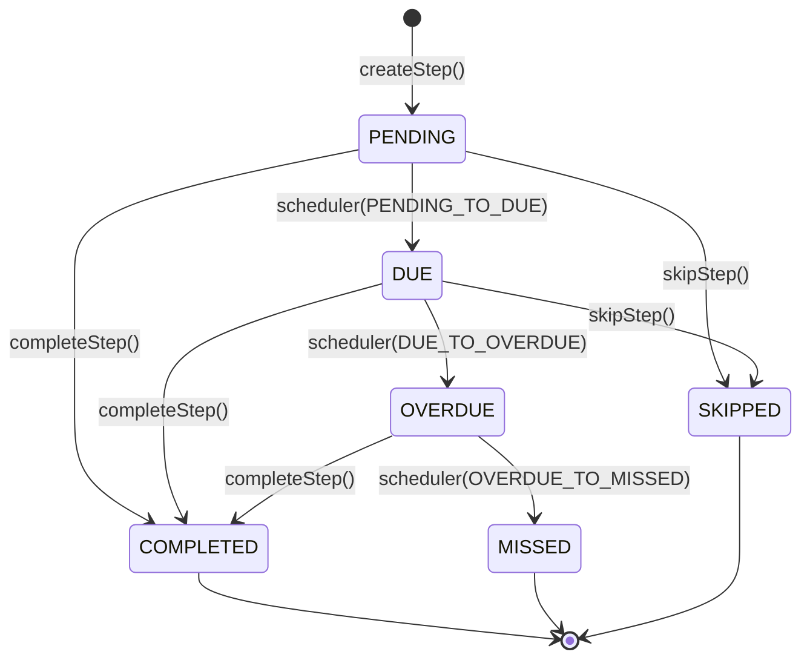

# Architecture & Design

## 1. System Context

The **CCE Compliance Service** is a core microservice within the **Clinical Compliance Engine (CCE)** platform. It tracks patient adherence to clinical protocols defined as FHIR R4 `PlanDefinition` resources — consuming clinical events, matching them against protocol steps, detecting deviations, and publishing intelligence triggers for downstream analytics.



**This service does NOT handle:** event collection/ingestion (CCE Collector Service), scheduling (CCE Scheduler Service), analytics, alerting (CCE Intelligence Service), or user authentication (Keycloak).

## 2. Technology Stack

| Category | Technology | Version | Purpose |
|---|---|---|---|
| **Runtime** | Java | 21 LTS | Language runtime |
| **Framework** | Spring Boot | 3.4.2 | Application framework |
| **Persistence** | Spring Data JPA / Hibernate | 6.x | ORM and data access |
| **Database** | PostgreSQL | 16 | JSONB, GIN indexes, table partitioning |
| **Migration** | Flyway | 10.x | Schema version management |
| **JSONB Mapping** | Hypersistence Utils | 3.7.3 | JPA ↔ PostgreSQL JSONB |
| **Messaging** | Spring Kafka | 3.x | Event-driven messaging |
| **FHIR** | FHIR Libraries | 4.0.1 | FHIR R4 PlanDefinition parsing & validation |
| **Expression** | json-logic-java | 1.0.7 | Tier 2 conditional evaluation (JSONLogic) |
| **Security** | Spring Security OAuth2 | 6.x | JWT authentication (Keycloak) |
| **Metrics** | Micrometer + Prometheus | 1.x | Application metrics |
| **Tracing** | OpenTelemetry | 1.x | Distributed tracing |
| **Testing** | JUnit 5 + Mockito | 5.x / 5.x | Unit testing with mocked dependencies |

## 3. Package Structure

```
org.openphc.cce.compliance
├── ComplianceServiceApplication.java          # @SpringBootApplication entry point
├── config/                                    # AppConfig, ObservabilityConfig
├── domain/
│   ├── entity/                                # 7 JPA entities
│   ├── enums/                                 # 6 value-based enums
│   └── repository/                            # 7 Spring Data JPA repositories
├── fhir/                                      # FHIR parsing, JSONLogic & FHIRPath evaluation
├── kafka/
│   ├── config/                                # Consumer/Producer factories, topic bindings
│   ├── consumer/                              # InboundEventConsumer, SchedulerTriggerConsumer
│   ├── model/                                 # CloudEventMessage, IntelligenceTriggerEvent
│   └── producer/                              # IntelligenceTriggerProducer
├── service/                                   # 8 business logic classes
└── web/                                       # Controllers, DTOs, DtoMapper, ExceptionHandler
```

## 4. Core Pipeline — ComplianceEngine

The `ComplianceEngine` is the central orchestrator. All inbound event processing flows through it:



### 4.1 Resource Extraction

Resource metadata is extracted from the CloudEvent **payload** (`data`), never from the envelope:

| Field | Extraction Paths |
|---|---|
| `resourceType` | `data.resourceType` (e.g., `"Observation"`, `"Encounter"`) |
| `allCodes` | `data.code.coding[*]`, `data.type.coding[*]`, `data.category[*].coding[*]`, `data.clinicalStatus.coding[*]`, `data.status` |

## 5. Two-Tier Matching Algorithm

### 5.1 Tier 1 — Structural Match

Inverted index lookup on the `trigger_index` table using `GROUP BY` + `HAVING` to enforce **AND semantics** across all `codeFilter` entries:

```sql
SELECT protocol_definition_id, action_id
FROM trigger_index
WHERE resource_type = :resourceType
  AND ((path = :path1 AND code_system = :sys1 AND code_value = :code1)
    OR (path = :path2 AND code_system = :sys2 AND code_value = :code2))
GROUP BY protocol_definition_id, action_id
HAVING COUNT(DISTINCT path) = :totalCodeFilterCount;
```

The index is built at protocol load time by decomposing each action's `TriggerDefinition.data[].codeFilter[]` into `(resourceType, path, codeSystem, codeValue, protocolDefinitionId, actionId)` rows.

### 5.2 Condition-Only Triggers

Triggers that have no `data[]` section (only a `condition`) are **not indexed** in `trigger_index`. They are held in-memory and evaluated via Tier 2 for every inbound event. These are validated at protocol load time — a trigger with no `data[]` and no `condition` is rejected.

### 5.3 Tier 2 — Condition Evaluation

For each Tier 1 candidate, evaluates the trigger's `condition` expression.  **Triggers with no `condition` pass automatically**.

| Variable | Source |
|---|---|
| `event` | CloudEvent data payload |
| `patient` | Patient context (`patientId`, demographics) |
| `step` | Current step context (`actionId`, `repeatIndex`, `state`) |
| `protocol` | Protocol context (`protocolCanonical`, `status`) |

**Supported languages:**
- `text/jsonlogic` — via `io.github.jamsesso.jsonlogic.JsonLogic`
- `text/fhirpath` — via FHIR `IFhirPath` engine (R4)
- Any other — rejected with `UnsupportedExpressionLanguageException`

## 6. State Machines

### 6.1 Step Instance



**Completion status:** `EARLY` (before dueDate), `ON_TIME` (between due and overdue), `LATE` (after overdueDate or state was OVERDUE).

### 6.2 Protocol Instance

`ACTIVE → COMPLETED | WITHDRAWN | EXPIRED`. Terminal states: `COMPLETED`, `WITHDRAWN`, `EXPIRED`.

Protocol completion is **automatic** — when all steps reach terminal states (`COMPLETED`, `MISSED`, `SKIPPED`), the protocol transitions to `COMPLETED`. There is no manual complete endpoint; `WITHDRAWN` covers manual termination.

## 7. Security

- **Authentication:** OAuth 2.0 JWT Bearer tokens via Keycloak (`cce-production` realm)
- **Authorization:** `compliance:read` (GET), `compliance:write` (POST/DELETE protocol-definitions), actuator endpoints are public
- **Stateless** — no server-side sessions, CSRF disabled

See [API Reference](api-reference.md) for endpoint-level details.

## 8. Observability

### 8.1 Metrics

| Metric | Type | Description |
|---|---|---|
| `cce.events.processed` | Counter | Total inbound events processed |
| `cce.events.matched` | Counter (tagged) | By status: `matched`, `zero_match` |
| `cce.events.duplicate` | Counter | Duplicate events detected |
| `cce.step.matching.duration` | Timer | Tier 1 + Tier 2 matching time |
| `cce.protocol.instances.active` | Gauge | Active protocol instances |

### 8.2 Logging & Tracing

- **Format:** `timestamp [thread] [correlationId] level logger - message`
- **Tracing:** OpenTelemetry (OTLP), `correlationId` propagated via MDC and CloudEvents extensions
- **Health:** `/actuator/health` (liveness + readiness), `/actuator/prometheus`

## 9. Error Handling

### 9.1 REST API

| Error Type | HTTP Status |
|---|---|
| Resource not found | 404 |
| Invalid input | 400 |
| State conflict | 409 |
| FHIR validation failure | 422 |
| Internal error | 500 |

### 9.2 Kafka

- **Consumer errors:** Message NOT acknowledged → Kafka redelivers
- **Processing errors:** Message NOT acknowledged → Kafka redelivers
- **Producer:** Idempotent with `acks=all`
- **Deserialization:** `ErrorHandlingDeserializer` wraps errors gracefully

## 10. Scaling

| Dimension | Strategy |
|---|---|
| **Horizontal** | Kafka consumer group enables multi-instance; partition assignment is automatic |
| **Database** | Connection pool per instance (20 max); `event_log` monthly-partitioned |
| **Kafka** | 3 concurrent listener threads per instance |
| **API** | Stateless — any instance serves any request |
