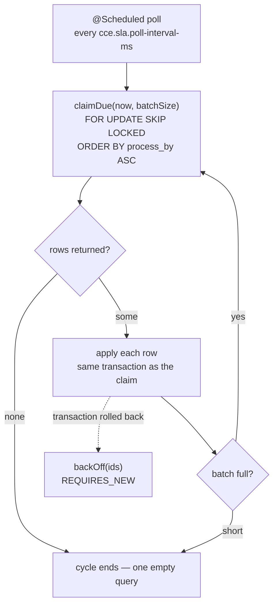

# Architecture & Design — Compliance Service

> The time plane: what happens because a deadline passed, not because an event arrived.

System-wide context — why the services are split, the shared schema, the SLA handoff contract — lives
in the **cce-common-util** repository's
[Architecture Overview](../../cce-common-util/docs/architecture-overview.md). This document covers
only what is specific to this service.

---

## 1. Responsibility

Everything driven by **time passing**:

1. Claim the `step_sla_state_transition` rows the Matcher Service scheduled, once they fall due.
2. Advance `step_instance.sla_status`.
3. Record the resulting `OVERDUE` / `MISSED` deviations.
4. Evaluate the intelligence actions those deviations trigger, and publish them.

It also exposes a read API over `intelligence_event_log`.

**What it does not do**: match inbound events, enrol patients, create or complete steps, or manage
definitions. It has no Kafka consumer — nothing inbound reaches it. `ORDER_VIOLATION` deviations stay
with the Matcher Service, which detects them at completion from the event itself.

## 2. Owns no tables

This service creates nothing. Flyway is **disabled**; `ddl-auto` is `validate`.

Enabling Flyway here would add an empty ledger and invite a second service to write DDL for tables it
does not own. Instead the service validates its JPA mapping against the schema at startup and fails
fast if what it needs is absent — which is also how a deployment-order mistake surfaces immediately
rather than as a runtime error hours later.

Deploy **last**. Table ownership and the full ordering rationale:
[Data Dictionary §3](../../cce-common-util/docs/data-dictionary.md#3-ownership).

## 3. The claim protocol

Three properties make this safe without any coordination machinery:

**The row lock is the claim.** `FOR UPDATE SKIP LOCKED` means a row locked by one replica is
*invisible* to the others rather than contended, so every replica can poll the same table
concurrently. There is no lease table, no heartbeat, and no leader election. A replica that dies
mid-batch drops its connection, its locks release, and the work is immediately claimable again — no
lease expiry to wait out.

**Claim and apply share one transaction.** Claiming in one transaction and applying in another would
leave a window where a row is marked taken but not yet acted on, and a crash inside that window makes
the state permanent. Here there is no such window: either the row is applied and committed, or the
lock is released and nothing happened.

**Batches drain within a cycle.** The evaluator keeps claiming until a batch comes back short, so a
backlog that accumulated while the service was down clears in one cycle rather than one batch per
interval. `MAX_BATCHES_PER_CYCLE` (100) stops a pathological backlog from monopolising the thread.

`ORDER BY process_by ASC` means the oldest deadline is always handled first, so a backlog degrades by
latency rather than by dropping the most overdue work.

### Why a driver and an applier

`SlaTransitionEvaluator` polls and loops; `SlaTransitionApplier` holds the `@Transactional`
boundary. They are separate beans because `@Transactional` takes effect through the Spring proxy — a
scheduled method calling a transactional method **on itself** bypasses the proxy entirely and runs
with no transaction at all. Splitting them is what makes the annotation real.

The evaluator's `poll()` never propagates: a failed cycle must not kill the scheduler thread.

## 4. What the applier does

The event may have arrived between the transition being scheduled and its deadline falling due, so the
action depends on the step as found:

| `step_status` | `completed_at` vs `process_by` | Action |
|---|---|---|
| `NOT_STARTED` | — | advance `sla_status`, record the deviation |
| `COMPLETED` | `>= process_by` | leave `sla_status`, record the deviation — the work was late |
| `COMPLETED` | `< process_by` | consume the row, do nothing — the event beat the deadline |

In the second case the Matcher Service already settled `sla_status` at completion, from the clinical
occurrence time. Overwriting it here would replace a judgement made from the event with one made from
the clock. The deviation is still recorded, because the deadline was genuinely breached.

| Transition | Deviation |
|---|---|
| `PENDING_TO_OVERDUE` | `DeviationType.OVERDUE` |
| `OVERDUE_TO_MISSED` | `DeviationType.MISSED` |

An **optional** step (`could`) that misses resolves to `SlaStatus.MET` with no deviation: nothing was
required, so nothing was breached.

The applier **never writes `step_status`**. That column belongs to the Matcher Service, and the whole
point of splitting the two columns was that neither service writes the other's — see
[Architecture Overview §4](../../cce-common-util/docs/architecture-overview.md#4-step-status-and-sla-status).

### Retry

A batch whose transaction rolled back is backed off rather than lost: `attempts` is incremented and
`next_attempt_at` pushed out by `2^attempts` seconds, capped at `cce.sla.max-backoff-seconds`. The
backoff write runs `REQUIRES_NEW`, because the transaction it is recovering from has already rolled
back — joining it would roll the backoff back too, and the row would be retried immediately in a tight
loop.

`processed_by` records which replica applied each row, so a misbehaving instance is identifiable from
the data.

## 5. Intelligence on deviation

When a deviation is newly recorded — not when it already existed — the shared
[`IntelligenceActionEvaluator`](../../cce-common-util/docs/library-reference.md#intelligenceactionevaluator)
evaluates the step's intelligence actions and publishes any that fire to
`cce.intelligence.triggers`.

The de-duplication matters: without it, a transition retried after a failure would re-trigger an alert
a clinician has already received. `DeviationService` reports whether the row was new, and the
evaluation is gated on that.

This service is **produce-only** on Kafka. Its `KafkaConfig` declares a producer factory, a template
and the outbound topic — no consumer factory, no listener container, no DLQ, because nothing is
consumed.

## 6. Observability

| Metric | Type | Meaning |
|---|---|---|
| `cce.sla.transitions.unprocessed` | gauge | rows due but not yet applied — the primary health signal |
| `cce.sla.transitions.applied` | counter | transitions that advanced a step's SLA |
| `cce.sla.transitions.consumed` | counter | rows resolved without a deviation (the event beat the deadline) |
| `cce.sla.evaluator.cycles` | counter | polling cycles run |
| `cce.sla.evaluator.batches.failed` | counter | batches that rolled back and were backed off |

The gauge is the one to alert on. It sits near zero in a steady state and rises when transitions fall
due faster than they are applied — which is the failure this service can actually have. A sustained
rise means the sweep is not keeping up; a rise with `batches.failed` climbing alongside means rows are
failing and backing off rather than the sweep being slow.

`cycles` incrementing with everything else flat is the normal idle signature, and distinguishes "no
work to do" from "scheduler stopped".

## 7. Scaling

Scales with the **backlog**, not with inbound traffic — that is the reason it is a separate service.
A burst of clinical events cannot delay the SLA sweep, and a large SLA backlog cannot delay event
processing.

Replicas are safe to add freely: the claim protocol needs no coordination, and adding an instance adds
claim throughput directly. The limiting factor is database contention on
`step_sla_state_transition`, not anything in the application.

`cce.sla.batch-size` trades transaction length against round trips. A larger batch holds row locks
longer, which matters only if the Matcher Service is inserting into the same table heavily at the same
time.

## 8. Security

No authentication at the application layer; the read API is expected to sit behind the gateway
service. The service performs no writes on behalf of a caller — every write it makes is driven by the
scheduler, from rows another service created.
