# Flow Diagrams

This document provides detailed sequence and flow diagrams for all major workflows in the CCE Compliance Service.

---

## 1. Inbound Clinical Event Processing (End-to-End)

This is the primary workflow — processing a clinical event from Kafka through the entire compliance engine pipeline.

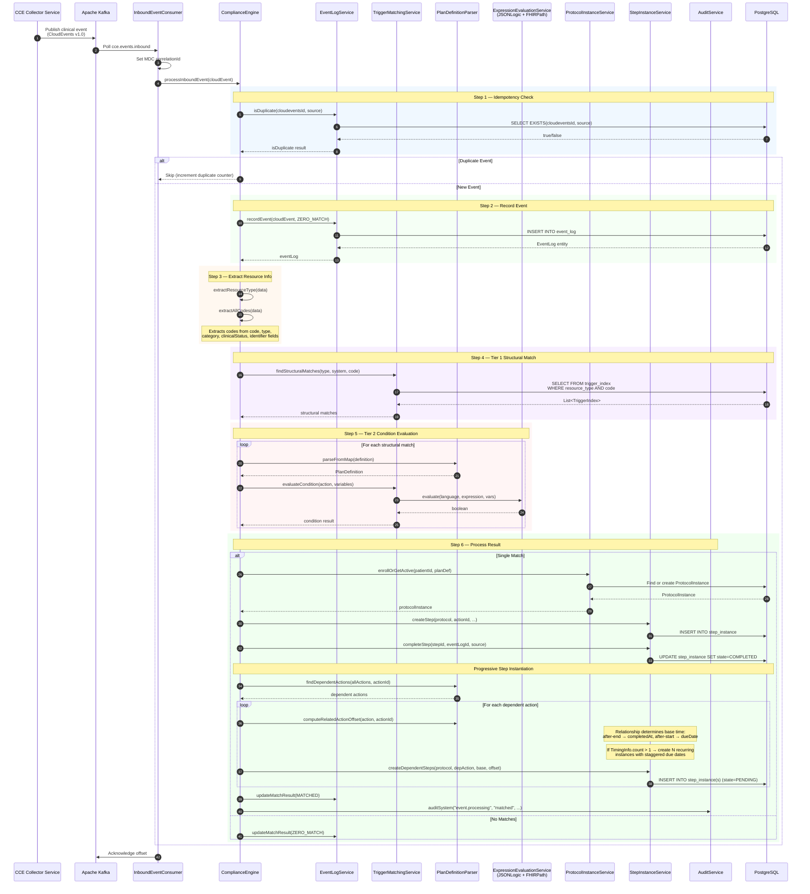

## 2. Protocol Definition Loading Flow

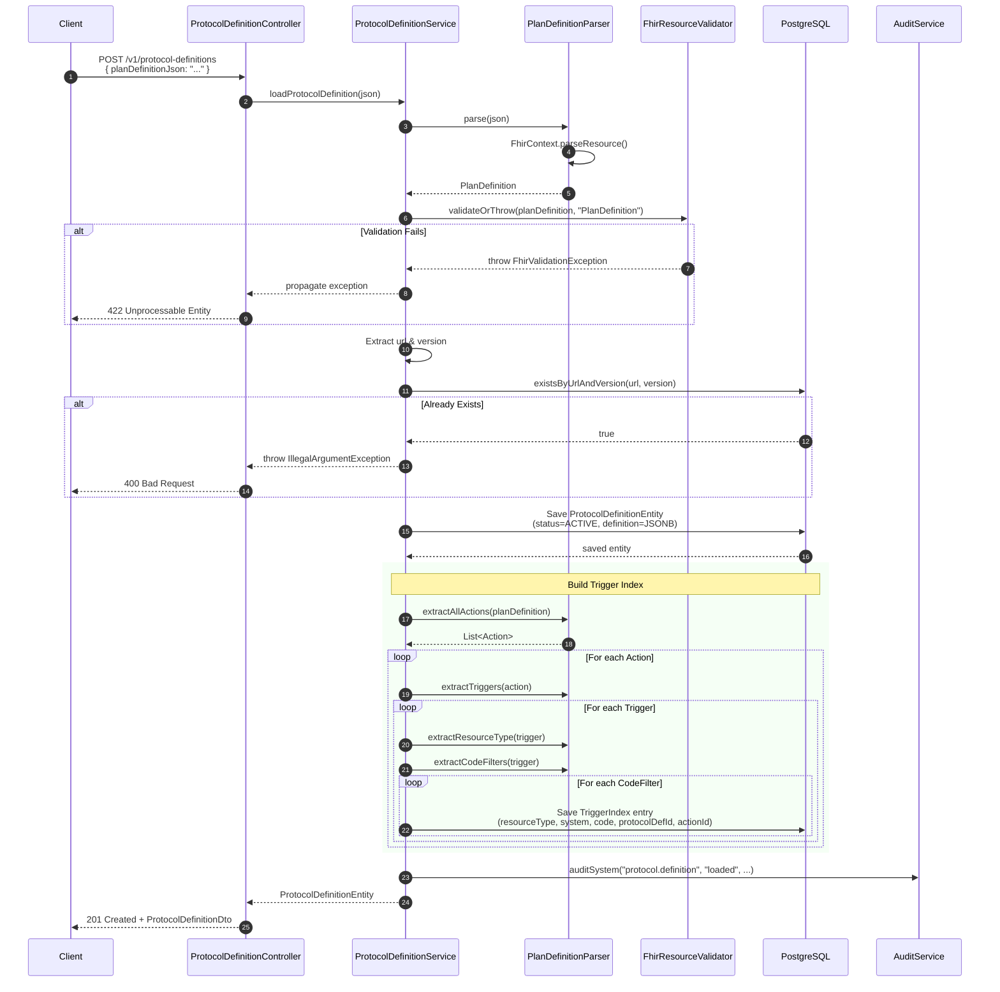

## 3. Scheduler-Driven State Transitions

> The Scheduler Service polls `step_instance` for time-threshold crossings and publishes trigger messages to Kafka. See [Architecture Overview §1.1](architecture-overview.md#11-scheduler-service-contract) for the polling query, lease mechanism, and ownership boundaries. The diagram below shows the Compliance Service side — receiving and processing those triggers.

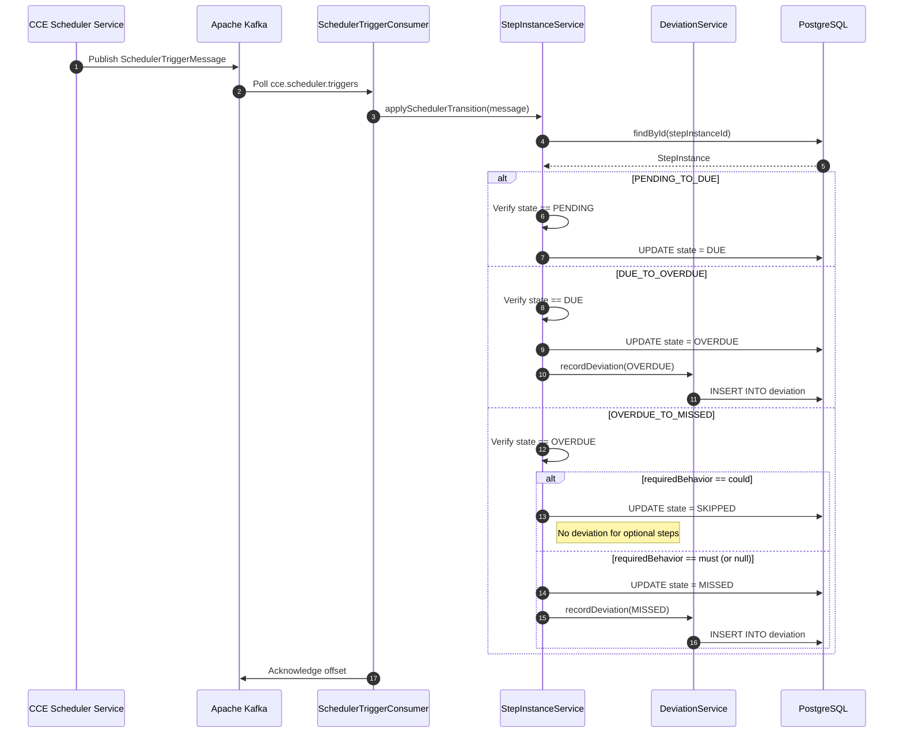

## 4. Protocol Enrollment Flow

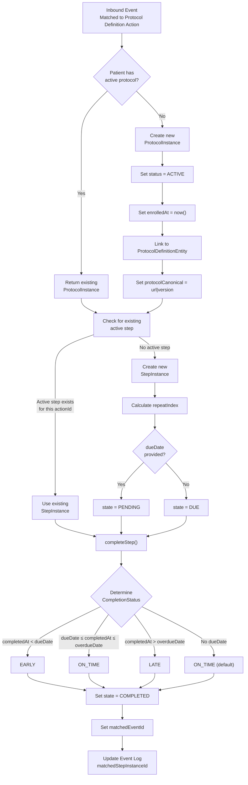

## 5. Deviation Detection & Recording

> **Intelligence action evaluation** is triggered after each deviation is recorded. See §6 for the full intelligence pipeline flow.

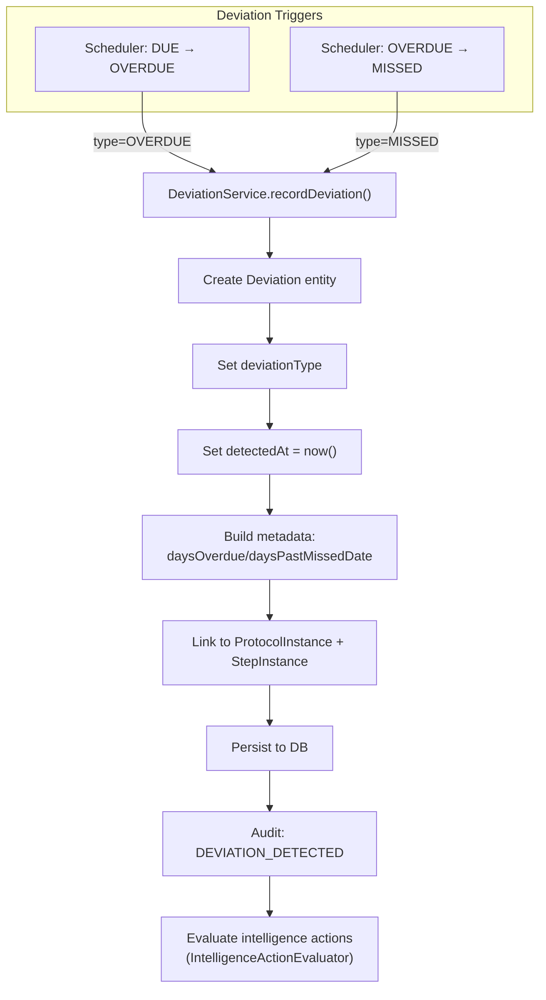

## 6. Intelligence Action Evaluation & Trigger Publishing

This flow is triggered after a deviation is detected (OVERDUE/MISSED) or after a step is completed. The `IntelligenceActionEvaluator` evaluates PlanDefinition intelligence action conditions and publishes intelligence events.

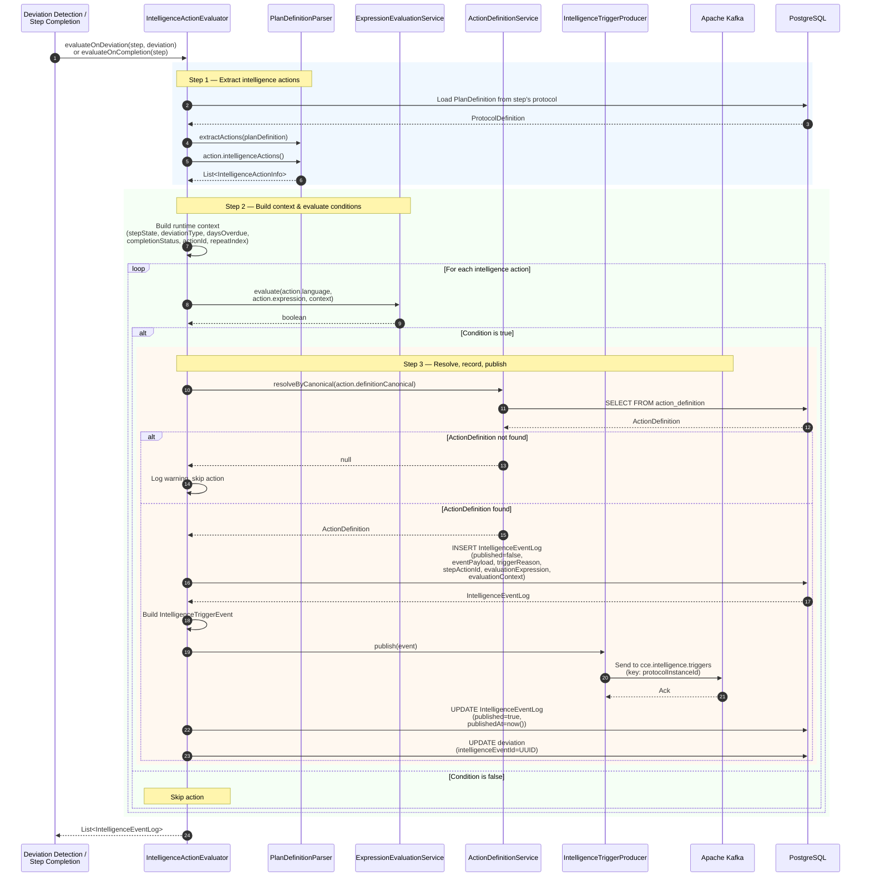

### Intelligence Event Content Assembly

```mermaid
flowchart TD
    subgraph "Input Sources"
        STEP["StepInstance<br/>(state, actionId, dueDate, completedAt)"]
        DEV["Deviation<br/>(deviationType, detectedAt, metadata)"]
        PI["ProtocolInstance<br/>(patientId, protocolCanonical, facilityId)"]
        RULE["IntelligenceActionInfo<br/>(actionId, definitionCanonical, severity, intelligenceDestination)"]
        ACTDEF["ActionDefinition<br/>(actionType, title)"]
    end

    subgraph "IntelligenceTriggerEvent"
        E_ID["id: UUID (new)"]
        E_TYPE["type: cce.compliance.deviation.overdue"]
        E_SUBJECT["subject: patientId"]
        E_PI["protocolInstanceId"]
        E_SI["stepInstanceId"]
        E_DI["deviationId"]
        E_DT["deviationType: overdue"]
        E_SS["stepState: overdue"]
        E_AID["actionId: anc-visit-2"]
        E_PC["protocolCanonical: url|version"]
        E_FID["facilityId: 0002"]
        E_DAT["detectedAt: timestamp"]
        E_META["metadata: {...}"]
    end

    STEP --> E_SS
    STEP --> E_AID
    STEP --> E_SI
    DEV --> E_DI
    DEV --> E_DT
    DEV --> E_DAT
    DEV --> E_META
    PI --> E_SUBJECT
    PI --> E_PI
    PI --> E_PC
    PI --> E_FID
    RULE --> E_TYPE
    ACTDEF --> E_META
```

## 7. REST API Request Flow

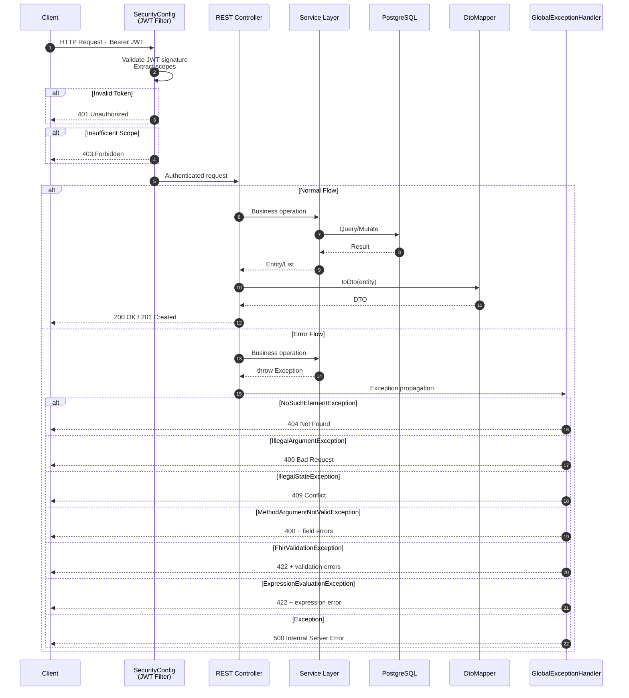

## 8. Kafka Consumer Error Handling

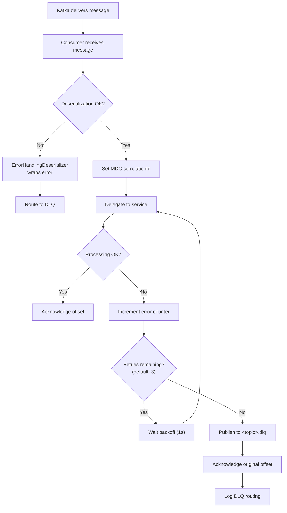

## 9. Multi-Level Sub-Step Processing

This diagram shows how the engine processes an inbound event that matches a deeply-nested sub-step trigger (e.g., composite actionId `"grandparent-group/parent-group/leaf-step"`).

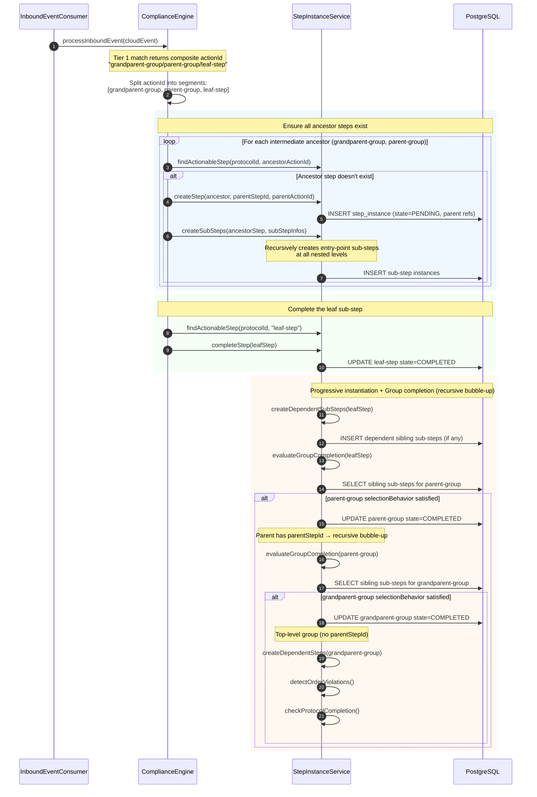

### Sub-Step Creation (Recursive)

Shows how `createSubSteps()` handles nested groups recursively when a group step is first instantiated.

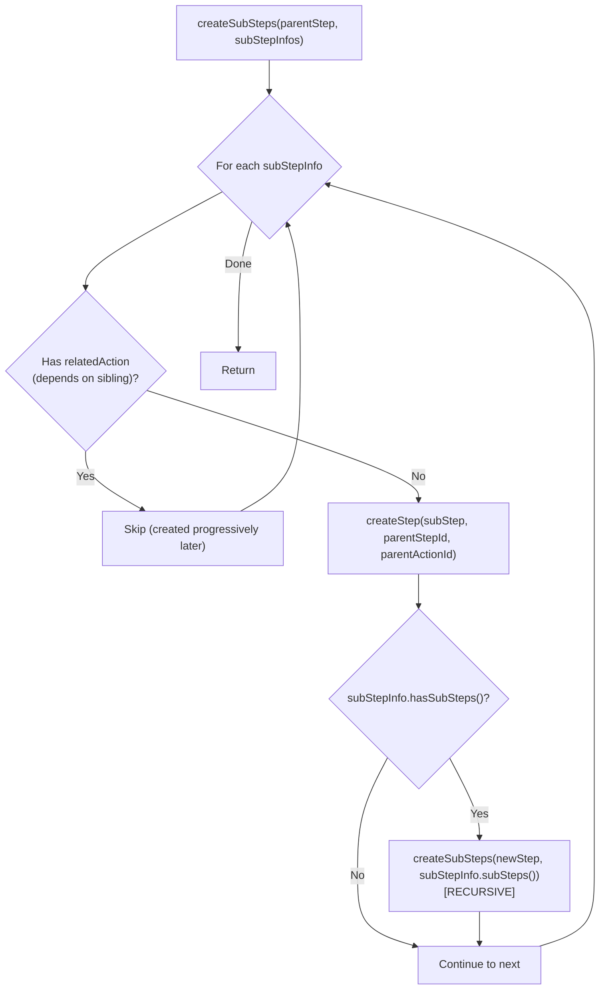
