# Flow Diagrams

This document provides detailed sequence and flow diagrams for all major workflows in the CCE Compliance Service.

---

## 1. Inbound Clinical Event Processing (End-to-End)

This is the primary workflow — processing a clinical event from Kafka through the entire compliance engine pipeline.

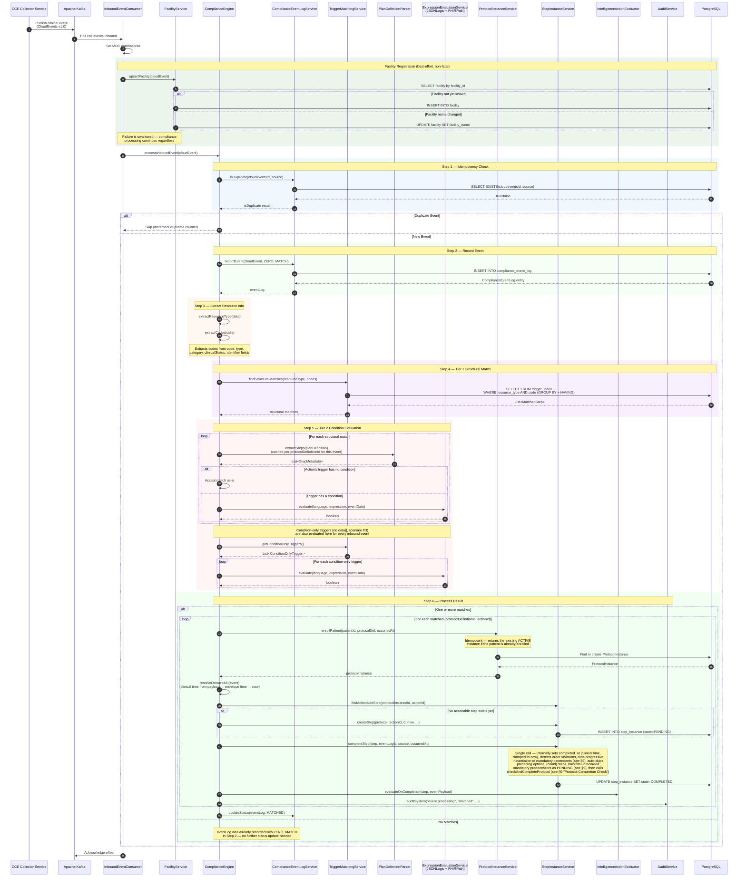

## 2. Protocol Definition Loading Flow

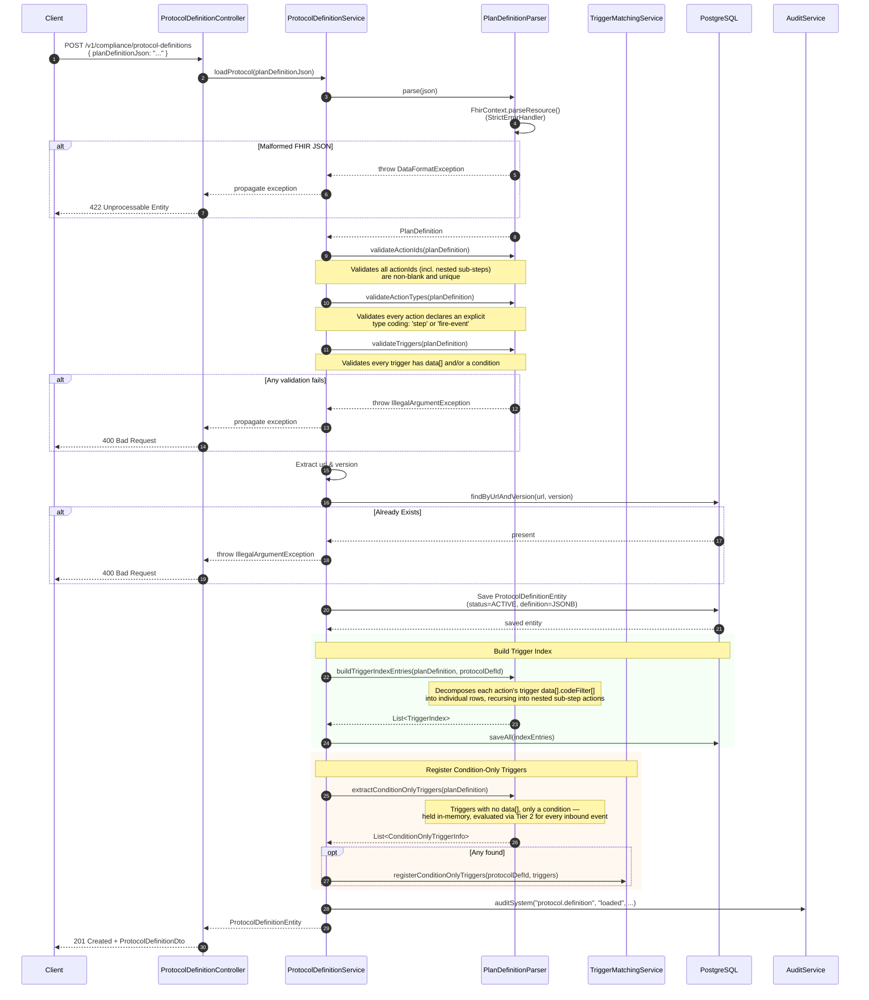

## 3. Scheduler-Driven State Transitions

> The Scheduler Service polls `step_instance` for time-threshold crossings and publishes trigger messages to Kafka. See [Architecture Overview §1.1](architecture-overview.md#11-scheduler-service-contract) for the polling query, lease mechanism, and ownership boundaries. The diagram below shows the Compliance Service side — receiving and processing those triggers.

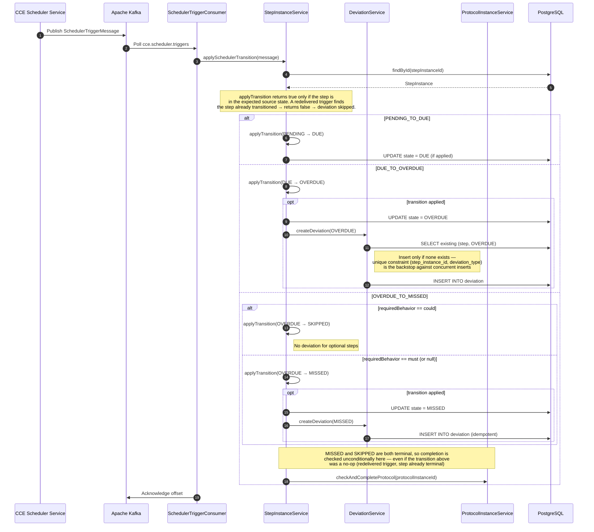

## 4. Protocol Enrollment Flow

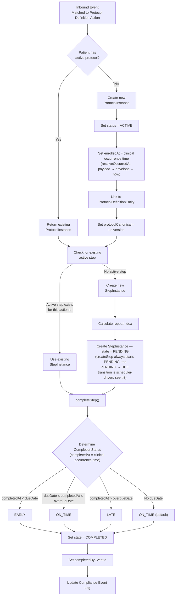

## 5. Deviation Detection & Recording

> **Intelligence action evaluation** is triggered after each deviation is recorded. See §6 for the full intelligence pipeline flow.

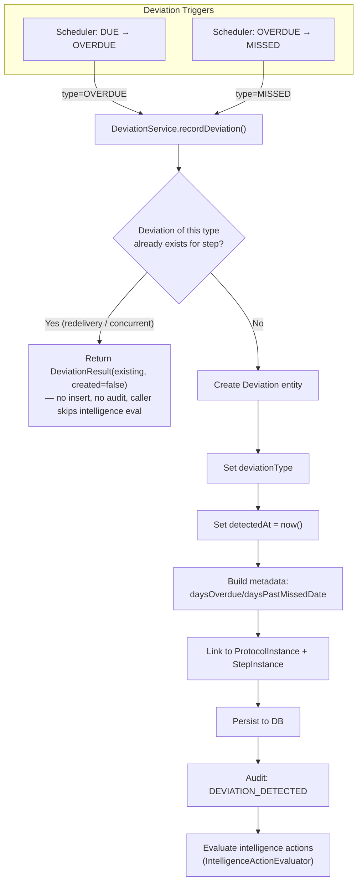

## 6. Intelligence Action Evaluation & Trigger Publishing

This flow is triggered after a deviation is detected (OVERDUE/MISSED) or after a step is completed. The `IntelligenceActionEvaluator` evaluates PlanDefinition intelligence action conditions and publishes intelligence events.

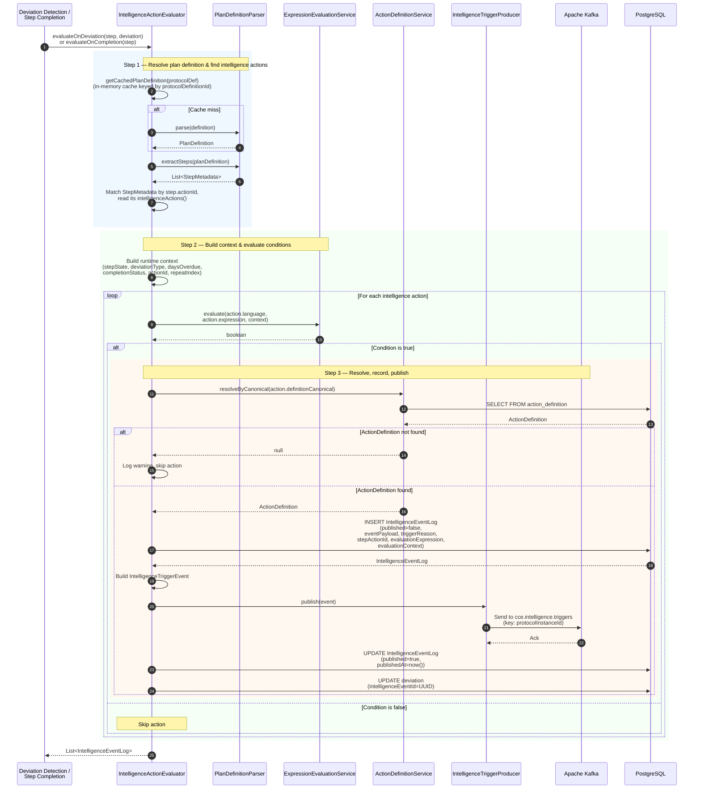

### Intelligence Event Content Assembly

```mermaid
flowchart TD
    subgraph "Input Sources"
        STEP["StepInstance<br/>(state, actionId, dueDate, completedAt)"]
        DEV["Deviation<br/>(deviationType, detectedAt, metadata)"]
        PI["ProtocolInstance<br/>(patientId, protocolCanonical, facilityId)"]
        RULE["IntelligenceActionInfo<br/>(actionId, definitionCanonical, severity, intelligenceDestination)"]
        ACTDEF["ActionDefinition<br/>(actionType, title)"]
    end

    subgraph "IntelligenceTriggerEvent"
        E_ID["id: UUID (new)"]
        E_TYPE["type: cce.compliance.deviation.overdue"]
        E_SUBJECT["subject: patientId"]
        E_PI["protocolInstanceId"]
        E_SI["stepInstanceId"]
        E_DI["deviationId"]
        E_DT["deviationType: overdue"]
        E_SS["stepState: overdue"]
        E_AID["actionId: anc-visit-2"]
        E_PC["protocolCanonical: url|version"]
        E_FID["facilityId: 0002"]
        E_DAT["detectedAt: timestamp"]
        E_META["metadata: {...}"]
    end

    STEP --> E_SS
    STEP --> E_AID
    STEP --> E_SI
    DEV --> E_DI
    DEV --> E_DT
    DEV --> E_DAT
    DEV --> E_META
    PI --> E_SUBJECT
    PI --> E_PI
    PI --> E_PC
    PI --> E_FID
    RULE --> E_TYPE
    ACTDEF --> E_META
```

## 7. REST API Request Flow

## 8. Kafka Consumer Error Handling

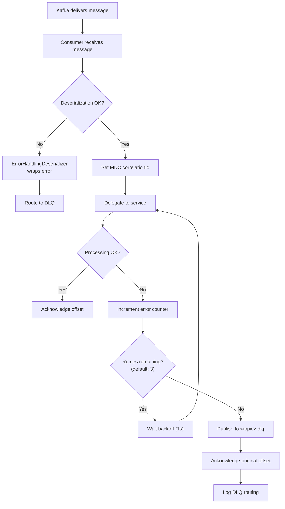

## 9. Flat Sub-Step Processing

All steps (including those originally nested in `action.action[]`) are treated as peers. Nested step-type actions are flattened at parse time with `relatedSteps` linking them to their parent. No separate sub-step routing is needed — the standard matching and completion flow handles them uniformly.

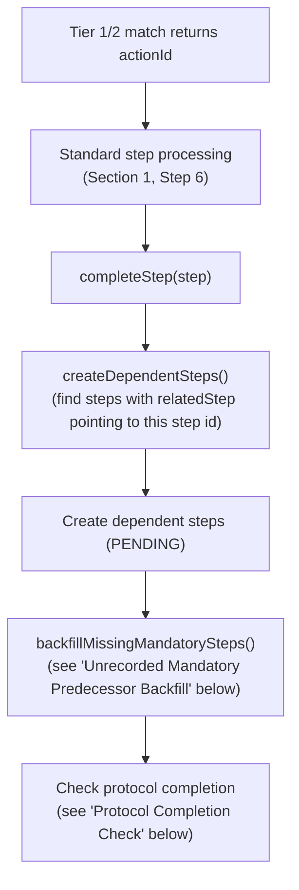

### Dependent Step Creation on Completion

When any step completes, `createDependentSteps()` finds all steps whose `relatedSteps` reference the completed step's id and creates them with appropriate due dates.

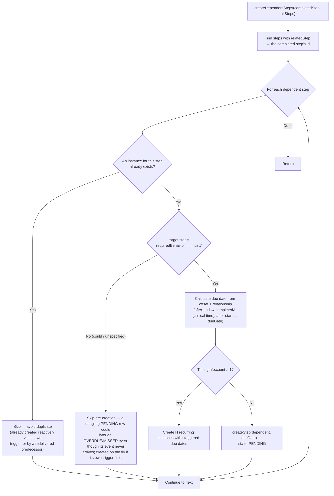

### Unrecorded Mandatory Predecessor Backfill (backfillMissingMandatorySteps)

Progressive instantiation only works *forward*, so a step created reactively from its own trigger leaves the mandatory steps that should have preceded it with no `step_instance` row — invisible both in the journey view ("not started") and to the Scheduler. After every completion, mandatory predecessors of the observed progress that have no row are materialized as `PENDING`. See `architecture-overview.md` §6.1 for the full rationale.

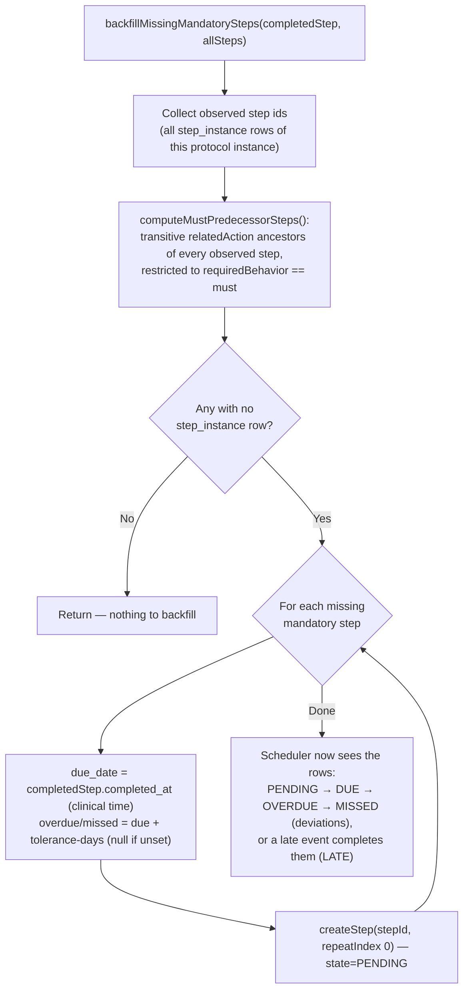

> Steps still **ahead** in the chain are deliberately excluded — backfilling them would stamp them with this completion's time and flatten the schedule their own `relatedAction` offsets define. They are left to progressive instantiation; the wider `computeExpectedMustSteps` set still gates protocol completion.

### Protocol Completion Check (checkAndCompleteProtocol)

Called at the end of `completeStep()` and, unconditionally, from the `OVERDUE_TO_MISSED` scheduler transition (§3). A protocol instance only moves to `COMPLETED` once no materialized step is still actionable **and** every mandatory ("must") action that the observed progress implies is satisfied — where "implied" covers three cases: the observed action itself, its transitive `relatedAction` predecessors (ancestors), and any mandatory action nested under the same top-level PlanDefinition action (a "group sibling"), even one whose own trigger never fired and so was never materialized as a step_instance row.

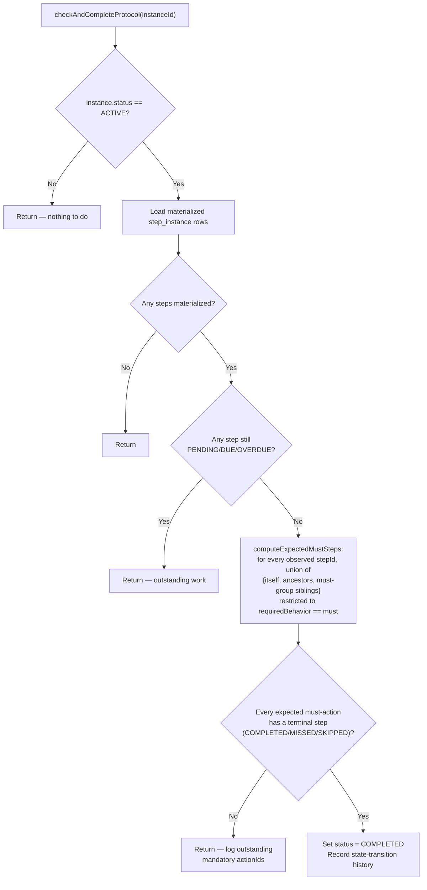
